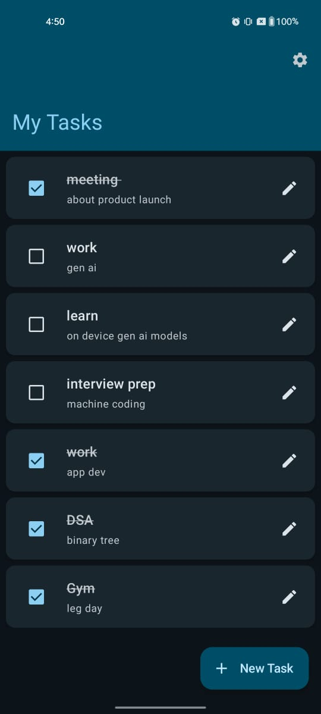

# Task Manager Android Application


A modern Android app for task management with API integration, Firebase Analytics, and Room persistence, built using Jetpack Compose and Clean Architecture.

## 📱 Features
- **Task Management**: Create, edit, delete, and mark tasks as completed.
- **REST API Integration**: Fetch mock tasks from a public API ([dummyjson](https://dummyjson.com)).
- **Local Persistence**: Save tasks offline using Room Database.
- **Analytics & Monitoring**: Track events, network performance, and crashes via Firebase.
- **Material Design UI**: Clean and intuitive user interface.

---

## 🛠️ Setup Instructions

### Prerequisites
- Android Studio
- Firebase project setup ([Guide](https://firebase.google.com/docs/android/setup))

### Steps
1. **Clone the Repository**
   ```bash
   git clone https://github.com/ankitprs/task-management.git
   ```
2. **Add Firebase Configuration**
   Place your `google-services.json` file in `app/` directory.
3. **Build the Project**
   Sync Gradle and build the app.
4. **Run the App**
   Use an emulator or physical device with Android 8.0+.

---

## 🏗️ Architecture & Design Decisions

### Tech Stack
- **MVVM + Jetpack Compose**:
  Separates UI logic from business logic. ViewModel survives configuration changes, while Compose enables declarative UIs.
- **Clean Architecture**:
  Layers:
  - **Data**: Room, Retrofit, Firebase
  - **Domain**: Use Cases, Repository Interfaces
  - **Presentation**: Compose Screens, ViewModels
- **Dependency Injection**:
  Hilt for simplified DI and testability.

### Key Implementation Details
- **Repository Pattern**:
  Centralizes data operations from API and Room DB, ensuring a single source of truth.
- **Analytics Events**:
  Tracked via Firebase Analytics for:
  - `task_added`
  - `task_edited`
  - `task_completed`
- **Crash Handling**:
  - **Forced Crash**: Triggered via a debug-only button using `throw RuntimeException()`.
  - **Database Crash**: Simulated by inserting invalid data (e.g., empty task title).
- **Network Monitoring**:
  Firebase Performance Monitoring tracks API call durations.

---

## 📸 Screenshots & Demos

### Firebase Analytics
| Event Tracking | Crash Reports | Network Performance |
|----------------|---------------|---------------------|
|  |  |  |

### App UI
| Light Mode | Dark Mode | Add Task | Setting |
|-----------|----------|----------|-----------|
|  |  |  |  |

**Screen Recording**: [Watch Demo](demo/demo.mp4)

---

## 🧪 Testing

### Unit Tests
Run via Android Studio or CLI:
```bash
./gradlew test
```
- **ViewModel Tests**: Mock repository to validate business logic.
- **Use Case Tests**: Verify task operations.

### Instrumented Tests
```bash
./gradlew connectedAndroidTest
```
- **UI Tests**: Espresso tests for task creation/deletion.

---

## 🔄 Third-Party Integrations

### Firebase
- **Analytics**: Log user interactions.
- **Crashlytics**: Capture and report crashes.
- **Performance Monitoring**: Measure API latency.

### Room Database
- **Entities**: `Task` model with `id`, `title`, `completed`, and `timestamp`.
- **Migrations**: Handled via `Room.databaseBuilder().addMigrations()`.

### Retrofit
- **API Service**: `TaskApiService` interface for HTTP methods.
- **Mock Data**: Uses JSONPlaceholder’s `/todos` endpoint.

---

## 🚨 Troubleshooting
- **Firebase Not Initialized**: Ensure `google-services.json` is correctly placed.
- **API Failure**: Check network connection; mock API may throttle requests.
- **Room Migration Errors**: Delete app data or increment database version.

---

## 📜 License
MIT License. See [LICENSE](LICENSE) for details.

## 📧 Contact
For issues or questions, contact [ankitpr2001@gmail.com](mailto:ankitpr2001@gmail.com).